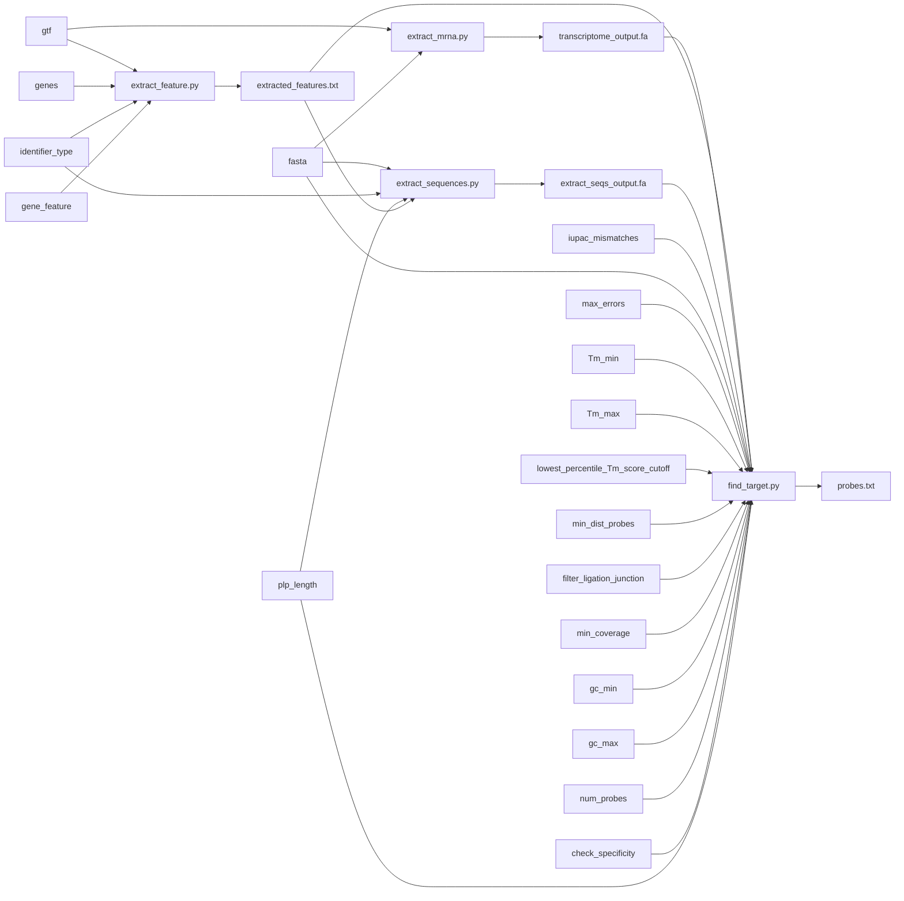

# Installation  
## Step 1: Install Docker
Before using the provided Dockerfile, ensure Docker is installed on your system. Follow the official instructions based on your operating system:

[Docker Installation Guide](https://docs.docker.com/engine/install/)  
Ensure Docker is properly installed by running the following command in your terminal:  
```
docker --version
```
## Step 2: Clone the GitHub Repository
Clone the repository containing the Dockerfile to your local machine. Replace <repository-url> with the actual URL of your repository:
```
git clone https://github.com/Moldia/PLP_directRNA_design_V2.git
cd PLP_directRNA_design_V2
```
## Step 3: Build the Docker Image
Build the Docker image using the docker build command. Replace <image-name> with a name of your choice for the image:
```
docker build -t plp_probe_design_v2 .
```
# Running the docker image   
After successfully building the image, create and run a container using the following command:
```
docker run -it -v $PWD:/app plp_probe_design_v2
```

You can test whether `cutadapt` is installed:  
```
cutadapt --version
```

# Running  
## Extract features
`python3 codes/extract_features.py --gtf data/tmp.gtf --genes Grik2 --identifier_type gene_name --gene_feature CDS --output extract_features_output.txt`

## Extract transcriptome
`python3 codes/extract_mrna.py --gtf data/tmp.gtf --fasta data/Mus.fa --output_file data/transcriptome_out.fa`  

_This step can be parallelized together with `extract_features.py` and the output is required by last step `find_target.py`_  

## Extract sequences
`python3 codes/extract_sequences.py --fasta data/Mus.fa --output_fasta extract_seqs_output.fa --identifier_type gene_name --plp_length 30 --gtf_output extract_features_output.txt`

## Find targets
`python3 codes/find_target.py --selected_features extract_features_output.txt --fasta_file extract_seqs_output.fa --output_file targets.txt --iupac_mismatches "5:R,10:G" --reference_fasta data/transcriptome_out.fa --max_errors 4 --Tm_min 58 --Tm_max 62 --lowest_percentile_Tm_score_cutoff 5 --min_dist_probes 8 --filter_ligation_junction`


