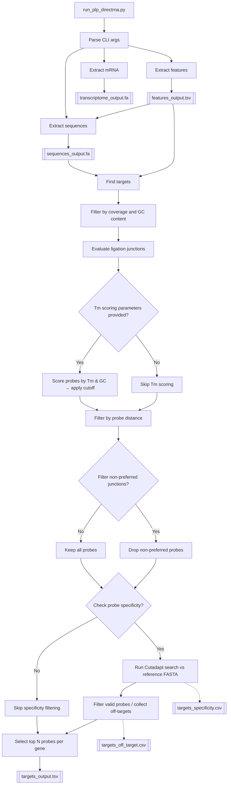

# Installation  
## Step 1: Install Docker
Before using the provided Dockerfile, ensure Docker is installed on your system. Follow the official instructions based on your operating system:

[Docker Installation Guide](https://docs.docker.com/engine/install/)  
Ensure Docker is properly installed by running the following command in your terminal:  
```
docker --version
```
## Step 2: Clone the GitHub Repository
Clone the repository containing the Dockerfile to your local machine. Replace <repository-url> with the actual URL of your repository:
```
git clone https://github.com/Moldia/PLP_directRNA_design_V2.git
cd PLP_directRNA_design_V2
```
## Step 3: Build the Docker Image
Build the Docker image using the docker build command. Replace <image-name> with a name of your choice for the image:
```
docker build -t plp_probe_design_v2 .
```
# Running the docker image   
After successfully building the image, create and run a container using the following command:
```
docker run -it -v $PWD:/app plp_probe_design_v2
```

You can test whether `cutadapt` is installed:  
```
cutadapt --version
```

# Running  
## Run whole workflow  
```
python3 codes/run_plp_directrna.py \
    --gtf data/tmp.gtf \
    --genes Grik2 \
    --identifier_type gene_name \
    --features_output features_output.txt \
    --fasta data/Mus.fa \
    --transcriptome_output data/transcriptome_out.fa \
    --sequences_output extract_seqs_output.fa \
    --targets_output targets.txt \
    --min_coverage 1 \
    --gc_min 50 \
    --gc_max 65 \
    --num_probes 10 \
    --iupac_mismatches None \
    --max_errors 1 \
    --check_specificity \
    --plp_length 30 \
    --min_dist_probes 10 \
    --filter_ligation_junction
```



```mermaid
flowchart TD
  A[run_plp_directrna.py] --> B[Parse CLI args]
  B --> C[Extract features]
  C --> COUT[[features_output.tsv]]

  B --> D[Extract mRNA]
  D --> DOUT[[transcriptome_output.fa]]

  COUT --> E[Extract sequences]
  B --> E
  E --> EOUT[[sequences_output.fa]]

  %% Find targets block
  COUT --> F[Find targets]
  EOUT --> F
  F --> G[Filter by coverage and GC content]
  G --> H[Evaluate ligation junctions]
  H --> I{Tm scoring parameters provided?}
  I -- No --> J[Skip Tm scoring]
  I -- Yes --> K[Score probes by Tm & GC → apply cutoff]
  J --> L[Filter by probe distance]
  K --> L
  L --> M{Filter non-preferred junctions?}
  M -- Yes --> N[Drop non-preferred probes]
  M -- No --> N2[Keep all probes]
  N --> O{Check probe specificity?}
  N2 --> O
  O -- Yes --> P[Run Cutadapt search vs reference FASTA]
  P --> Q[Filter valid probes / collect off-targets]
  O -- No --> Q2[Skip specificity filtering]
  Q --> R[Select top N probes per gene]
  Q2 --> R
  R --> TOUT[[targets_output.tsv]]

  %% Optional results
  P -.-> S[[targets_specificity.csv]]
  Q -.-> U[[targets_off_target.csv]]
```
